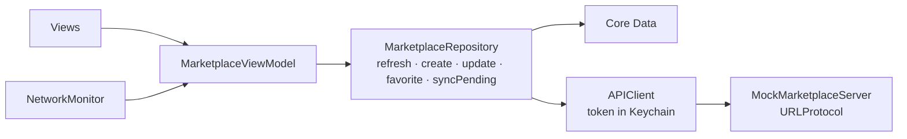

# Rogers Marketplace

Offline-first marketplace app for the Rogers mobile developer assignment (Assignment 2). Browse listings, favorite them, and create or edit listings while offline; changes sync when the network is back.

SwiftUI, MVVM, Core Data, async/await. iOS 17+. No third-party dependencies.

There is no backend, so the app includes a small mock REST API (`MockMarketplaceServer`) that answers `URLSession` requests in-process. The networking code is the same as it would be against a real server.

## Run

1. Open `RogersMarketPlace.xcodeproj` in Xcode 26.3 or later, choose an iPhone simulator, Run.
2. To test offline: turn Wi-Fi off on the Mac (the simulator follows), or add `-simulateOffline` as a launch argument. Create a listing, then turn Wi-Fi back on.
3. Tests: ⌘U, or `xcodebuild test -project RogersMarketPlace.xcodeproj -scheme CI -destination 'platform=iOS Simulator,name=iPhone 17'`.
4. `-resetState` as a launch argument wipes the local database and token.

## How it works

Reads always come from Core Data. The API is only used to refresh the database and to upload rows marked `pending`.

- Creating or editing saves the listing locally with `syncStatus = pending`; the grid shows a *Pending* badge and the status bar counts waiting changes.
- When `NetworkMonitor` reports the app is online, the view model calls `syncPending()`, which uploads each pending listing (then its photo) and stores the server's copy as synced.
- Conflicts are last-write-wins on `updatedAt`: on upload the server keeps the newer version; on refresh the newer version wins, except that a row still pending locally is never overwritten.
- Favorites are local only.

## Requirements

- Mock REST endpoints: `POST /auth/token`, `GET /listings`, `PUT /listings/{id}`, `POST /listings/{id}/image`.
- Local persistence: Core Data; every listing carries `syncStatus`, `isFavorite` and the attached photo name.
- Offline queue: pending rows are uploaded by `syncPending()`; survives relaunch.
- Sync status: *Pending* / *Failed* badge per listing and a status bar (offline, N waiting, syncing, synced).
- Images: photo library and camera; attached photos shrunk to 1600 px; thumbnails decoded at 300 px for the grid and cached in an `NSCache` capped at 40 MB.
- Validation: `ListingValidator` (trim, length bounds, price range, required fields).
- Token storage: Keychain.
- CI: `.github/workflows/ci.yml` runs the `CI` scheme on every push.
- Tests: `MarketplaceRepositoryTests` runs the real stack (in-memory Core Data, Keychain, mock server) for create offline, sync with photo, merge, both conflict outcomes and failures; plus validator, image and one UI test.

## Performance with 200 listings

`LazyVGrid` only builds visible cells. Each cell asks for a 300 px thumbnail (~350 KB decoded) instead of the full image, and the `NSCache` limit keeps the whole grid under 40 MB of decoded images. Thumbnail decoding runs off the main thread; Core Data work runs on a background context.
